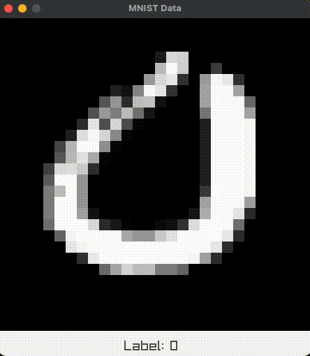
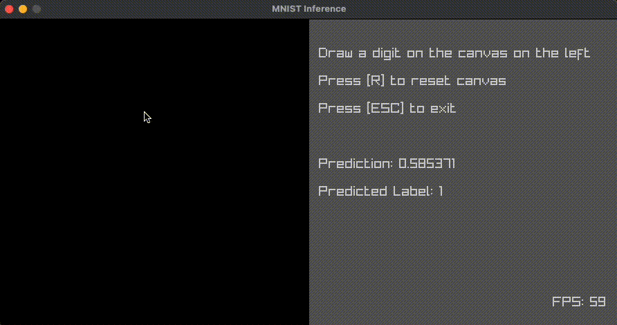

# micrograd.h

Similar to Andrej Karpathy's [micrograd](https://github.com/karpathy/micrograd) but in C

## Requirements

- C compiler
- [Task](https://taskfile.dev) or user-defined build system

If you're using Task, you can download MNIST data with: `task download:mnist` and if you're using macOS, then the dependencies (raylib and gzip) can be installed with `task install`. 

## Linear Regression

Run the linear regression example with: `task app=linreg`

In this example, we create a linear model and learn the values of weights `w1` and `w2` and bias `b` in the equation `y = w1 * x1 + w2 * x2 + b` for synthetically generated data with noisy labels. The equation can be constructed with `micrograd.h` in the following way:

```C
Value *y_pred = op_add(arena, op_add(arena, op_mul(arena, w1, x1), op_mul(arena, w2, x2)), b);
```

The loss can be calculated like:

```C
Value *diff = op_add(arena, op_mul(arena, minus_one, y), y_pred);
Value *loss = op_mul(arena, diff, diff);
```

Once we have the loss, we can create the computation graph for all the scalar values with:

```C
Graph *graph = graph_create(arena, loss, MAX_VALUES);
```

And finally, the _model_ can be trained with:

```C
graph_optimisation_step(graph, learning_rate);
```

## MNIST Data Visualisation

Run the MNIST data example with: `task app=mnist-viz`

In this example, we visualise MNIST data (just the 0s and 1s) as a sanity check! Once the application is running, press SPACEBAR to fetch next random sample and ESC to exit visualisation.



## Logistic Regression with MNIST Data

Run the MNIST Logistic Regression training with: `task app=mnist`

In this example, we train a linear model on 0s and 1s from the MNIST training dataset. Once the model is trained, an inference UI will show up:



The model can be created in the following way:

```C
Value **inputs = inputs_create(arena, input_dim);
Value *y = value_create_constant(arena, 0);

NetworkConfig config = {
    .num_inputs = input_dim,
    .num_layers = 1, // Just the output layer
    .num_neurons = (size_t[]) { 1 },
    .output_activation = ACT_SIGMOID
};

Value **outputs = network_create(arena, inputs, config);
Value *y_pred = outputs[0];
Value *loss = loss_mean_squared_error(arena, y, y_pred);
```

## Neural Network

(WIP) Run the neural network example with: `task app=nn`

This is similar to the above example except it uses a shallow neural network with 2 hidden layers with 2 hidden units/ neurons each. We can provide a network configuration and use it to create a densely connected network:

```C
// Provide network config
NetworkConfig config = {
    .num_inputs = 3,
    .num_layers = 3,
    .num_neurons = (size_t[]) { 3, 3, 1 },
    .hidden_activation = ACT_RELU,
    .output_activation = ACT_LINEAR
};

// Get network output
Value *y_pred = network_create(arena, inputs, config);
```

The approach to creating the computation graph and optimising it will remain the same.
